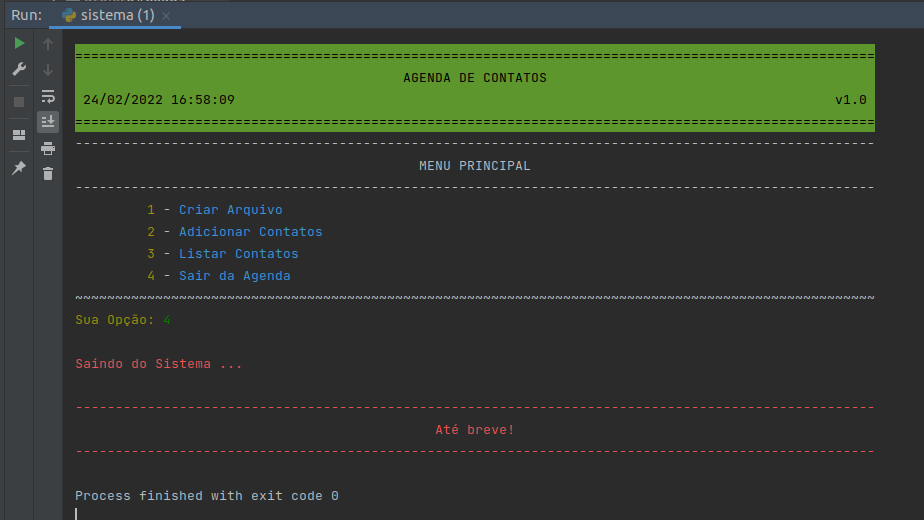

## Programa Desenvolve 40+ Magalu / Let's Code
### Python: Programação Orientada a Objetos (revisão de conteúdo)

## Agenda de contatos

#### Utilização dos conceitos:
 - classe
 - objetos
 - atributos
 - métodos

